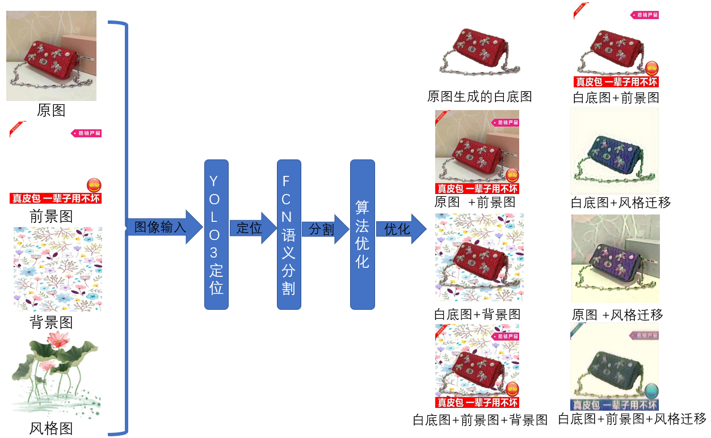
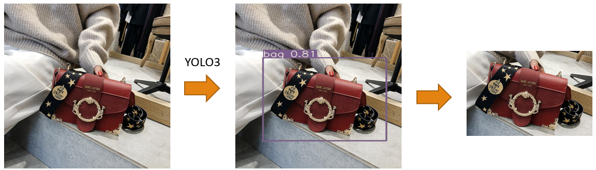
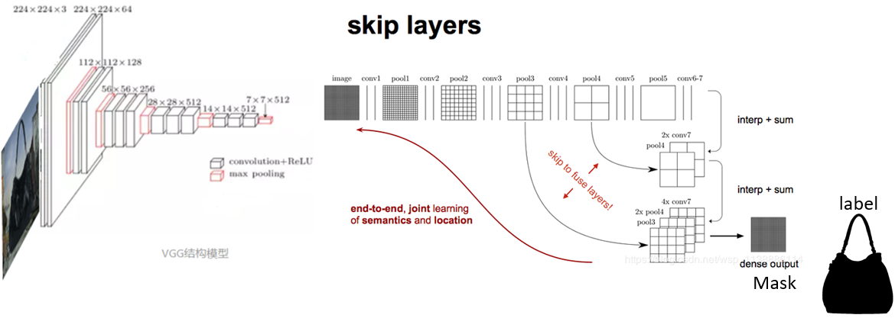
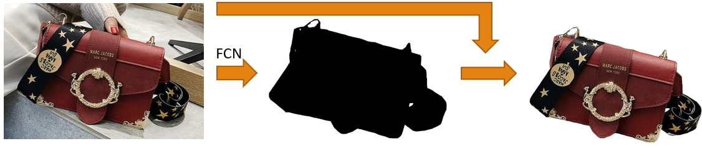
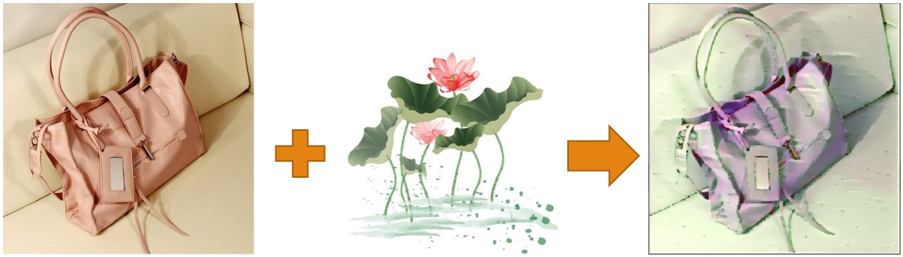
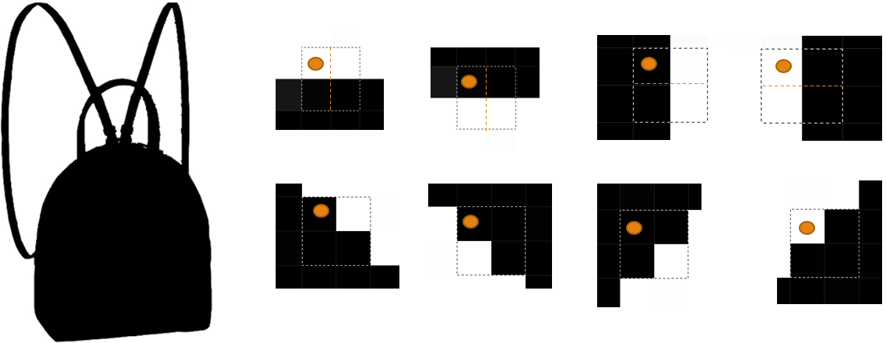
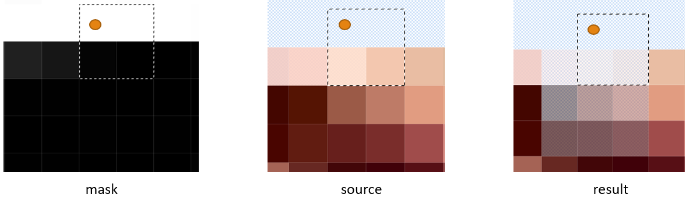
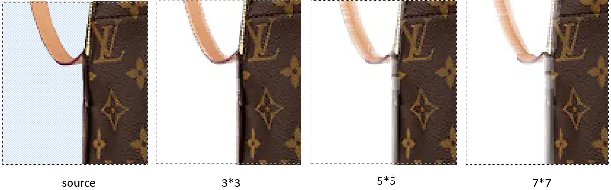

<h1>commodity-etoucher</h1>
<a href="./README_en.md">English</a>|<a href="./README.md">简体中文</a>

<strong>commodity-etoucher is an AI keyer that implements automatic keying, foreground background blending, and also supports custom style generation.</strong>

> This project originated from the 19 Alibaba 1688 Image Algorithm Competition. For the demo video address, please go to! [my blog](http://img.cmlt.fun/article/fcn演示.mp4) to view

## Feature
- Generate a white background image of the product
- Add product foreground image
- Add product background image
- Generate style image
- Local Client
- Web Client

## Update
- using Skip FCN, using the last 5 layers of VGG19 FEATURE MAP as FCN input to improve model accuracy;
- YOLO3 to locate the product images and improve the proportion of product images.
- using style migration to give artistic features to images and optimize image edges;
- self-developed algorithm to find the edge and direction of the image, adding alpha channel gradient transparency to optimize the image edge, [learn more](#image edge gradient transparency algorithm);
- Optimizing images using erosion expansion;
- filtering image noise using median filtering;
- adding the function of background image replacement;
- Add the foreground image replacement function
- adding local client UI;
- Porting functional parts to WEB server for online use.

## Caution
1. you need to download the corresponding features to extract the model weights yourself

## Quick start

1. environment installation
> Note that pytorch has to be installed separately first with torch >= 1.7.0

`pip install -r requirements.txt`

2. File download
- FCN dataset [download](http://img.cmlt.fun/article/fcnbagdata.zip), extract it to the root data folder
- YOLO dataset [download](http://img.cmlt.fun/article/yolobagdata.zip), extract it to the yolov3_master/data directory
3. Training
Execute in the yolov3_master directory to train the YOLO localization model
`python train.py`
Execute in the root directory to train the FCN semantic segmentation model
`python train.py`

4. Using the model
Start the local client ui
`python main.py`
Execute in the WEB/img directory to start the Django backend service
`python manage.py runserver`

## Technical framework
### YOLO model to complete the positioning of commodity images

### FCN model completes segmentation of product images

### Gram matrix to implement style migration

## Image edge gradient transparency algorithm
Using 2*2 filter traversing mask to find image edges, there are 16 cases in total, here only the following 8 cases are considered as valid edges, i.e. top, bottom, left, right, top left, top right, bottom left, bottom right. Take the case of the upper left corner of the figure below as an example: at this time, the 2*2 filter traversal case, the yellow ball represents the position of the current traversal pixel, fixed to the right, extending 1pix pixel downward, consisting of a 2*2 area; the upper white and lower black means that this is the upper edge.

After the corresponding edge is detected in the mask map, the transparency of the area (3*3) corresponding to the original core (the blob in the map) is modified to be gradually transparent, and the same is done for the other directions.

The core transparent areas are 3*3, 5*5, 7*7 edge images respectively, and the transparent areas can enhance the integration with the new background.

## To be done
- [ ] Due to occlusion of commodity images and algorithm flaws. Repair using GAN adversarial neural network;
- [ ] Create a database for image storage management and use crowdsourcing idea to use the images keyed by users for retraining;
- [ ] Improving the algorithm to improve the accuracy
- [ ] YOLO3, FCN to add other commodity localization training to improve the generality of the algorithm;
- [ ] Making all models end-to-end;
- [ ] WEB function improvement

## Contribute
Welcome PRs! If you want to contribute to this project, you can submit a pr or issue, there are some features in [to-do](#to-do) that can be extended. I'm glad to see more people involved in improving and optimizing it.