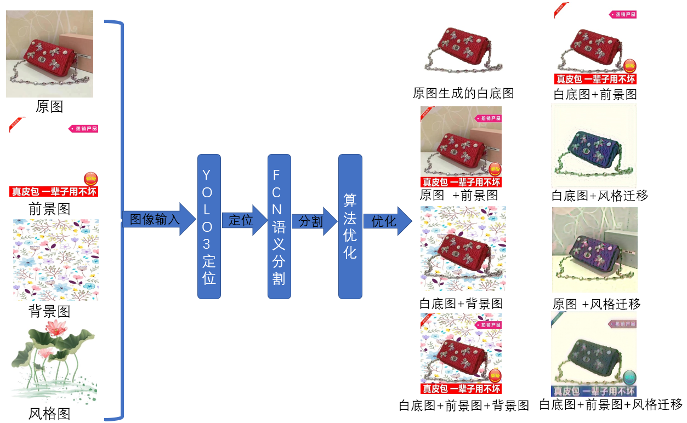
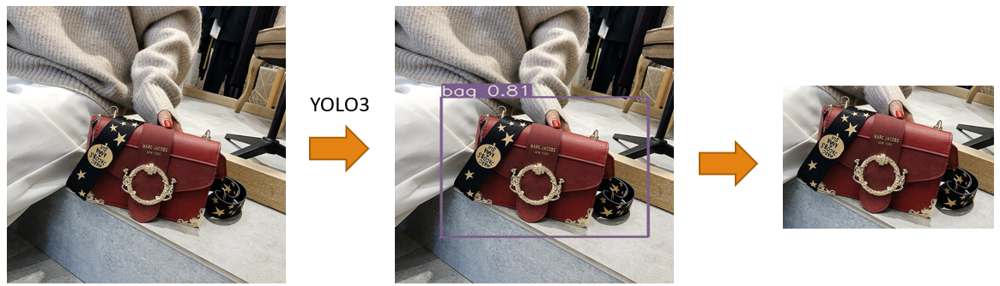
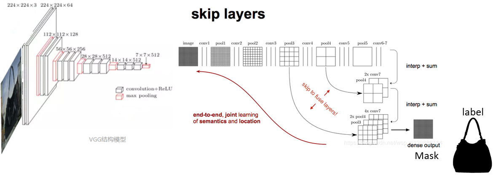
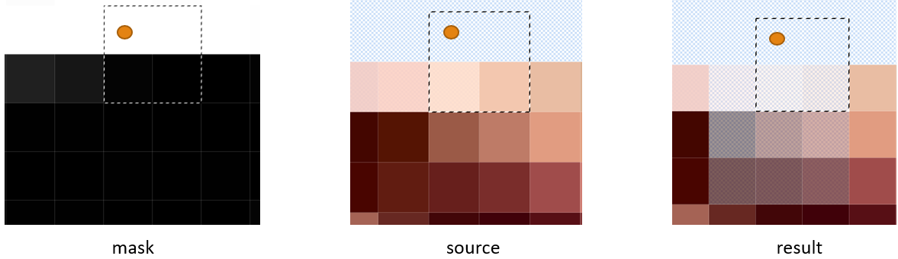

<h1>commodity-etoucher</h1>
<a href="./README_en.md">English</a>|<a href="./README.md">简体中文</a>

<strong>commodity-etoucher是一个AI抠图器，实现自动抠图，前景背景融合，还支持自定义风格生成。</strong>

> 本项目源于19年阿里巴巴1688图像算法大赛。演示视频地址请到[我的博客](http://img.cmlt.fun/article/fcn演示.mp4)查看

## 功能
- 生成商品白底图
- 添加商品前景图
- 添加商品背景图
- 生成风格图
- 本地客户端
- 网页客户端
  

## 更新

- 使用Skip FCN，将VGG19最后5层feature map作为FCN输入，提高模型精度；
- YOLO3对商品图像定位，提升商品图占比;
- 使用风格迁移，给图片赋予艺术特色，优化图片边缘；
- 自研算法寻找图像的边缘和方向，加入alpha通道梯段透明化优化图像边缘，[详细了解](#图像边缘梯度透明化算法)；
- 使用腐蚀膨胀优化图片；
- 使用中值滤波过滤图片噪音；
- 增加背景图替换功能；
- 增加前景图替换功能
- 增加本地客户端UI；
- 将功能部分移植到WEB服务器供线上使用。

## 注意事项
1. 需要自己下载对应的特征提取模型权重值

## 快速上手

1. 环境安装
> 注意pytorch要单独先安装torch >= 1.7.0
> `pip install -r requirements.txt`

2. 文件下载
- FCN数据集[下载](http://img.cmlt.fun/article/fcnbagdata.zip)，解压到根目录data文件夹下
- YOLO数据集[下载](http://img.cmlt.fun/article/yolobagdata.zip)，解压到yolov3_master/data目录下

3. 训练
在yolov3_master目录下执行，训练YOLO定位模型
`python train.py`
在根目录下执行，训练FCN语义分割模型
`python train.py`

4. 使用模型
启动本地客户端ui
`python main.py`
WEB/img目录下执行启动Django后端服务
`python manage.py runserver`
## 技术框架
### YOLO模型完成对商品图像定位

### FCN模型完成对商品图像分割

### Gram矩阵实现风格迁移

## 图像边缘梯度透明化算法
使用2*2的filter遍历mask寻找图像边缘，一共有16种情况，这里只认为以下8中情况为有效边缘，即上、下、左、右、左上、右上、左下、右下。以下图左上角情况为例：此时2*2的filter遍历的情况，黄色小球代表当前遍历像素的位置，固定为向右、向下延伸1pix像素，组成的2*2的区域；上白下黑说明这是上边缘。

在mask图检测到对应边缘后，将原图core（图中小球）对应的区域（3*3）透明度修改为逐渐透明，其他方向亦是如此。

core透明区域分别为3*3、5*5、7*7的边缘图像，透明区域能增强与新背景的融合度。

## 待办
- [ ] 由于商品图像被遮挡和算法的缺陷。使用GAN对抗神经网络进行修复；
- [ ] 建立数据库对图片存储管理，采用众包思想，将用户抠取的图像用于再训练；
- [ ] 改进算法，提高精度
- [ ] YOLO3、 FCN增加其他商品定位训练，提高算法的通用性；
- [ ] 将所有模型做成端到端；
- [ ] WEB功能完善

## 贡献
欢迎PRs！如果你想为这个项目做贡献，你可以提交pr或issue，[待办](#待办)中有一些可以扩展的功能。我很高兴看到更多的人参与改进并优化它。